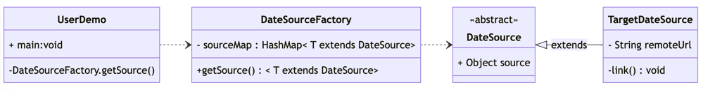

# 享元模式
## 介绍

享元模式是一种结构型设计模式，旨(zhǐ)在通过共享对象来减少内存占用,提高系统性能和资源的利用率



## 应用场景

- 大量重复对象：系统中存在大量重复对象，或这些对象大部分属性都相同，只是部分同一属性不同的情况
- 频繁创建销毁相同属性的对象：只读热点数据存在频繁初始化销毁的情况
- 共享对象：池化场景，例如常量池、链接池等
- 需要缓存的数据：同一对象短时间内重复使用，可以设置为缓存，临时管理

## 优点

- 减少内存使用量：大量重复的对象会对系统造成不必要的储存资源浪费，将多个相同对象用一个共享对象代替，减少内存使用
- 提高系统响应速度：共享对象一定程度的避免只读热点数据的重复创建销毁，提高提高系统性能个响应速度
- 简化对象结构：共享对象的维护往往脱离使用共享对象的对象，可将使用对象状态和共享对象状态分离，从而简化使用对象的结构

## 缺点

- 共享对象在多线程访问时需要考虑并发安全问题
- 提高了系统的复杂度，需要分离出共享对象状态和使用对象状态，而且共享对象状态具有固有化的性质，不应该随着使用对象状态的变化而变化，否则会因为修改共享对象而造成系统的混乱


## 实现

享元模式在jdk Integer的体现：

```java:no-line-numbers

//Integer的内部类,用于缓存最常用的-128到127的整形
private static class IntegerCache {
    static final int low = -128;
    static final int high;
    static final Integer cache[];

    static {
        // 可配置缓存的最大区间
        int h = 127;
        String integerCacheHighPropValue =
            sun.misc.VM.getSavedProperty("java.lang.Integer.IntegerCache.high");
        if (integerCacheHighPropValue != null) {
            try {
                int i = parseInt(integerCacheHighPropValue);
                i = Math.max(i, 127);
                h = Math.min(i, Integer.MAX_VALUE - (-low) -1);
            } catch( NumberFormatException nfe) {
            }
        }
        high = h;

        cache = new Integer[(high - low) + 1];
        int j = low;
        //初始化缓存
        for(int k = 0; k < cache.length; k++){
            cache[k] = new Integer(j++);
        }
        assert IntegerCache.high >= 127;
    }

    private IntegerCache() {}
}

```


```java:no-line-numbers
    //获取包装类
    public static Integer valueOf(int i) {
        if (i >= IntegerCache.low && i <= IntegerCache.high)
            return IntegerCache.cache[i + (-IntegerCache.low)];
        return new Integer(i);
    }

```


## 最后

享元模式往往是和池化和工厂一起使用，通过对象池管理共享对象的生命周期，通过工厂抛出对象访问出口

享元模式和单例模式的区别：
- 享元模式关注的是减少重复对象对内存的消耗,而单例模式关注的的对象的单一实例特性
- 享元模式并不一定共享对象为单一一个实例，可以是多组实例