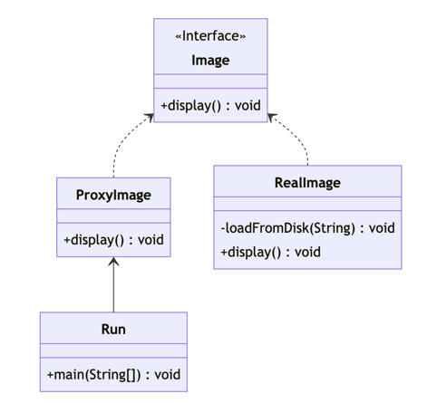

# 代理模式
## 介绍

代理模式是一种结构型设计模式，它充当了另一个对象的接口，以控制客户端对该对象的访问。代理模式可以为其他对象提供间接的访问方式，从而提高系统的安全性和可扩展性。



## 应用场景

- 远程代理：使用代理模式访问远程接口，屏蔽远程通信的细节，降低调用复杂度。
- 虚拟代理：创建昂贵的对象时，可以使用代理模式来临时代替对象在创建前和创建中的状态，当对象被创建后再由代理对象直接将请求委托给被代理对象。
- 安全代理：代理模式可以控制对象调用前后的前置或后置动作，利用这一点，可以对对象的访问加以权限控制。
- 动态代理：spring中常见的代理手法，可通过调用指令的不同情况使用代理类执行不同被代理实例或被代理实例方法。


## 优点

- 提高系统可扩展性：代理模式可以在不修改原始代码的情况下扩展被代理对象的功能。
- 职责清晰：屏蔽调用被代理对象所需要的一些细节，例如：RPC远程调用

## 缺点

- 增加复杂性：代理模式需要引入代理对象，这就增加了代码的复杂性。如果代理对象的实现不够完善，可能会导致调用完善的被代理对象时出现致命的错误。
- 性能损失：由于代理对象需要额外的处理，所以代理模式会带来一定的性能损失。特别是在频繁访问实际对象的情况下，如若设计上没有考虑被代理对象的实际情况，代理模式可能会成为系统的瓶颈。
- 远程调用的问题：代理模式在RPC框架中较为常用，但是远程调用本身就具备这一定的风险，这些都会导致调用实际对象时候出现失败。
- SpringAOP的问题：aop的切面表达式有可能会“误伤”其所覆盖的接口，在对其覆盖的路径下开发者可能感知不到自己的接口是否被某些流程代理，也不知道有哪些代理类代理了当前的接口，这将为系统造成不易控制的风险。


## 实现

下面举一个虚拟代理的示例：
视频是一个较大的对象,在播放被播放前我们往往不需要获取它的影片信息，只当作一个引用传递

```java:no-line-numbers

public interface Video {
    void play(OutputStream os);
}

```

如果我们直接引用这个视频对象，由于这个对象不是懒加载视频数据，创建这个对象可能会消耗过多的内存，但是在播放之前我们并不需要这些。

```java:no-line-numbers

public class BigVideo implements Video{
    
    private final byte[] bytes;
    
    private final String videoPath;
    
    private static final VideoLoader vl = new VideoLoader();

    public BigVideo(String videoPath){
        this.videoPath = videoPath;
        this.load(videoPath);
    }

    @Override
    public void play(OutputStream os) {
        //播放
        os.write(bytes);
    }

    private void load(String videoPath){
        //伪代码加载视频
        this.bytes = vl.load(videoPath);
    }
}

```

为视频对象创建一个代理类，平常的时候充当视频的引用，当播放的时候再实际加载视频

```java:no-line-numbers

public class ProxyVideo implements Video{
    private Video video;
    private final String videoPath;

    public ProxyVideo(String videoPath){
        this.videoPath = videoPath;
    }

    @Override
    public void play() {
        if(video == null){
            video = new BigVideo(fileName);
        }
        video.display();
    }
}

```

## 最后

代理模式是十分常用的设计模式之一，他可以为对象提供间接访问的能力，从而提高系统扩展性和安全性，在例如：参数校验、路由匹配、RPC调用等场景上有很大的优势，但同时在使用时也应该评估其给系统带来的影响，也需要评估当前场景是否需要代理模式