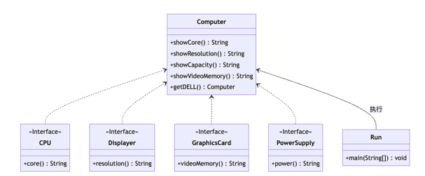

# 外观模式
## 介绍

外观模式是一种结构型设计模式，它为复杂的子系统提供了一个简单的接口，从而隐藏了子系统的复杂性，使得客户端可以更容易地使用子系统，常用的mvc三层结构中的Controller就是典型的外观模式。



## 应用场景

- 功能存在复杂的子系统功能调用：拼装一台电脑需要购买主板、电源、显卡、cup、风扇、硬盘、内存、机箱等设备，但如果了解了某个成品电脑的配置和型号，直接下单对应的型号就可以获得一个拼装好的成品电脑
- 服务器给客户端暴露的HTTP接口：于上面的拼装例子同理

## 优点

- 简化客户端代码：将复杂的子系统逻辑封装成一个简单的接口，从而简化客户端的代码。
- 提高灵活性：外观模式可以隔离客户端和子系统之间的依赖关系，从而提高系统的灵活性和可维护性。
- 提高系统可扩展性：外观模式可以为对多个子系统功能的访问提供一个统一的接口，从而方便系统的扩展和升级。

## 缺点

- 增加新的子系统可能需要修改外观类的代码，违反开闭原则。
- 外观模式可能会隐藏了子系统的复杂性，导致开发人员没有意识到子系统的真实复杂性，从而在设计和开发时出现问题。


## 实现

购买一台电脑，需要cpu、电源、显卡、显示器等

<CodeGroup>
<CodeGroupItem title="CPU">

```java:no-line-numbers
public interface CPU {
    //核心
    public String core();
}
```

</CodeGroupItem>
<CodeGroupItem title="电源">

```java:no-line-numbers
public interface PowerSupply {
    //功率
    public String power();
}
```

</CodeGroupItem>

<CodeGroupItem title="显卡">

```java:no-line-numbers
public interface GraphicsCard {
    //显存
    public String videoMemory();
}
```

</CodeGroupItem>

<CodeGroupItem title="显示器">

```java:no-line-numbers
public interface Displayer {
    //刷新率
    public String resolution();
}
```
</CodeGroupItem>
</CodeGroup>

或者我们直接购买一台dell的电脑
```java:no-line-numbers
public class Computer {
    private final CPU cpu;
    private final Displayer displayer;
    private final GraphicsCard graphicsCard;
    private final PowerSupply powerSupply;

    private Computer(CPU cpu, Displayer displayer, GraphicsCard graphicsCard, PowerSupply powerSupply) {
        this.cpu = cpu;
        this.displayer = displayer;
        this.graphicsCard = graphicsCard;
        this.powerSupply = powerSupply;
    }

    public static Computer getDELL(){
        return new Computer(() -> "10核心", () -> "8k", () -> "18G", () -> "850W");
    }
    
    public String showCore(){
        return cpu.core();
    }
    public String showResolution(){
        return displayer.resolution();
    }
    public String showVideoMemory(){
        return graphicsCard.videoMemory();
    }
    public String showCapacity(){
        return powerSupply.power();
    }
}
```