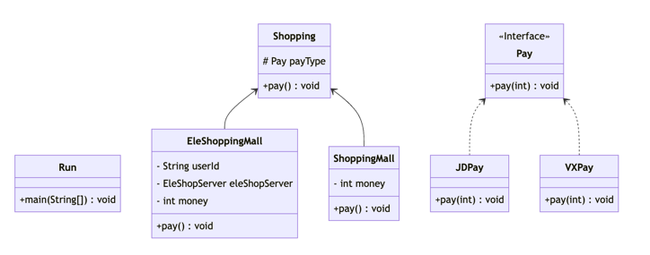

# 桥接模式
## 介绍

桥接模式是一种结构型设计模式，是用于把抽象化与实现化解耦，使得二者可以独立变化；使用一个交接的接口，是的实体类的功能独立于接口实现类，同时这两种类型的类可被结构化改变而互不影响。



## 应用场景

当系统中存在一个类需要两个纬度的变换，且两个纬度都需要扩展时，这时候就可以考虑桥接模式，例如：电源开关和电器之前通过电流桥接控制


## 优点

- 易维护：抽象和实现分离，两者单独迭代互不影响
- 可扩展：同样受益于它的抽象和实现分离的特点
- 实现细节对客户透明：后面会在代码中体现

## 缺点

- 由于桥接模式抽象和实现分离的特点，在设计难度上往往要高于普通的设计方式，需要开发者严格针对抽象进行设计，切莫搅乱桥接对象之间的关系。

## 实现

假设我们要去商城购物，商城支持两种付款方式，也存在多种购物行为，此时我们可以这样定义

先定义一个支付方式的接口，负责支付金额

```java:no-line-numbers

public interface Pay {
    public void pay(int money);
}

```

衍生出两种支付方式

<CodeGroup>

<CodeGroupItem title="京东支付">

```java:no-line-numbers

public class JDPay implements Pay{

    @Override
    public void pay(int money) {
        System.out.println("使用京东支付:"+money);
    }
}

```

</CodeGroupItem>

<CodeGroupItem title="微信支付">

```java:no-line-numbers

public class VXPay implements Pay{

    @Override
    public void pay(int money) {
        System.out.println("使用微信支付:"+money);
    }
}

```

</CodeGroupItem>

</CodeGroup>

之后我们定义桥接类，使用购物行为桥接支付方式和购物行为实现

```java:no-line-numbers

public abstract class Shopping {
    protected Pay payType;
    public Shopping(Pay payType){
        this.payType=payType;
    }
    public abstract void pay();
}

```

最后定义购物行为的实现，实现支付方式和购物行为的分离

<CodeGroup>

<CodeGroupItem title="线下商城购物">

```java:no-line-numbers

public class ShoppingMall extends Shopping{
    private final int money;
    public ShoppingMall(int money,Pay payType) {
        super(payType);
        this.money=money;
    }

    @Override
    public void pay() {
        payType.pay(money);
    }
}
```

</CodeGroupItem>

<CodeGroupItem title="电子商城购物">

```java:no-line-numbers

public class EleShoppingMall extends Shopping{
    private EleShopServer eleShopServer;
    private final String userId;
    private final int money;
    public EleShoppingMall(String userId,int money, Pay payType) {
        super(payType);
        this.userId=userId;
        this.money = money;
    }

    @Override
    public void pay() {
        User user = eleShopServer.findByUserId(userId);
        Account account = user.getAccount();
        //account - money;
        payType.pay(money);
    }
}

```

</CodeGroupItem>

</CodeGroup>

