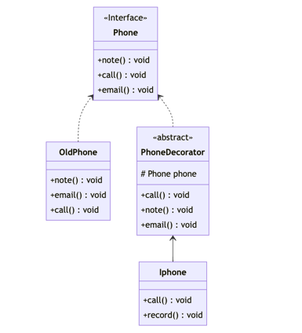

# 装饰器模式
## 介绍

装饰器模式是一种结构型设计模式，允许使用装饰类向一个现有的对象添加新的功能，同时又不改变其结构，



## 优点

- 可扩展性：通过装饰类扩展原有对象能力，而不需要继承原有对象，避免了继承带来的一些问题。
- 松耦合：装饰类和原有对象可以各自单独发展，不会出现耦合关系。

## 缺点

- 多层装饰会导致复杂性增加。当需要添加多个装饰器时，会形成一条长长的装饰链，这会给代码的维护和调试带来一定困难。

## 应用场景

- 需要在运行时动态地为对象添加新的行为：如果需要在运行时动态地为对象添加新的行为，那么可以使用装饰器模式来实现。
- 需要保持接口一致性：如果需要保持原有对象的接口不变，那么可以使用装饰器模式来实现。
- 避免使用继承：如果需要避免使用继承带来的一些问题，如爆炸性增长等，那么可以使用装饰器模式来实现。

## 实现

定一个手机的抽象，他只有基本的打电话、发邮件、记笔记的功能

```java:no-line-numbers
    public interface Phone {
        void call();
        void email();
        void note();
    }
```

存在一部老式的手机，他是手机的实现

```java:no-line-numbers
    public class OldPhone implements Phone {
        @Override
        public void call() {
            System.out.println("打电话");
        }
    
        @Override
        public void email() {
            System.out.println("发邮件");
        }
    
        @Override
        public void note() {
            System.out.println("记笔记");
        }
    }
```

为手机添加个装饰器以便扩展手机的功能

```java:no-line-numbers
    public class PhoneDecorator implements Phone {
        private Phone phone;
    
        public PhoneDecorator(Phone phone) {
            this.phone = phone;
        }
    
        @Override
        public void call() {
            phone.call();
        }
    
        @Override
        public void email() {
            phone.email();
        }
    
        @Override
        public void note() {
            phone.note();
        }
    }
```

iPhone是手机基本功能的扩展，他除了可以打电话、发邮件、记笔记，还可以在通话的时候记录通话记录

```java:no-line-numbers
    public class Iphone extends PhoneDecorator{
        public Iphone(Phone phone) {
            super(phone);
        }
    
        @Override
        public void call() {
            phone.call();
            record();
        }
    
        private void record(){
            System.out.println("通话记录");
        }
    
    }
```


## 最后

装饰器模式可以在运行时动态地为对象添加新的行为，同时又不改变其原有的结构和接口。通常适用于需要在运行时动态地为对象添加新的行为、需要保持原有对象的接口不变、需要避免使用继承带来的一些问题等场景。实现装饰器模式需要考虑装饰器和被装饰对象的接口、装饰器和被装饰对象的实现以及装饰器的创建和销毁等方面。
