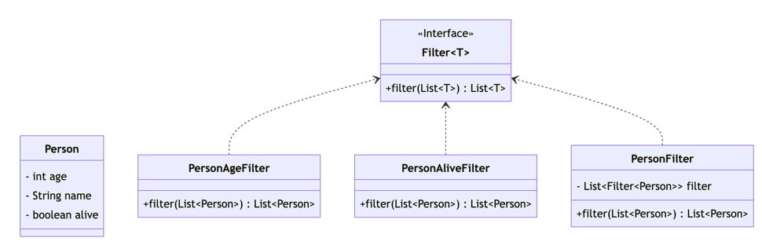

# 过滤器模式
## 介绍

过滤器模式是一种结构型设计模式，它允许开发人员使用不同的标准来过滤一组对象，从而通过逻辑运算得到想要的结果。



## 优点

- 简化了业务逻辑，提高了代码的可读性和可维护性。
- 可以灵活地组合过滤器，实现多种不同的过滤条件。
- 可以避免代码重复，提高了代码的复用性。

## 缺点

1. 过多的过滤器将会导致系统性能下降。每填加一个过滤器都将使处理流程增加n(集合的长度)
2. 过滤器之间的协调可能会导致问题。过滤器是顺序执行的，可能会出现前一个过滤器过滤掉了后一个过滤器需要的数据，多个过滤其的逻辑会取交集。

## 应用场景

集合的过滤

## 实现

我们需要对一组人进行过滤

```java:no-line-numbers
    public class Person {
        private String name;
        private int age;
        private boolean alive;
    }
```

定义一个过滤器接口
    
```java:no-line-numbers
    public interface Filter<T> {
        List<T> filter(List<T> list);
    }
```

存在两个过滤器的实现

<CodeGroup>

<CodeGroupItem title="年龄过滤器">
    
```java:no-line-numbers
    public class PersonAgeFilter implements Filter<Person>{
        @Override
        public List<Person> filter(List<Person> list) {
            return list.stream().filter(person -> person.getAge() > 0).collect(Collectors.toList());
        }
    }

```
</CodeGroupItem>

<CodeGroupItem title="存活过滤器">

```java:no-line-numbers
    public class PersonAliveFilter implements Filter<Person>{
    
        @Override
        public List<Person> filter(List<Person> list) {
            return list.stream().filter(Person::isAlive).collect(Collectors.toList());
        }
    }

```

</CodeGroupItem>

</CodeGroup>

定义一个用于管理对人过滤器的管理过滤器

``` java:no-line-numbers
    public class PersonFilter implements Filter<Person> {
        private final List<Filter<Person>> filter;
    
        public PersonFilter(List<Filter<Person>> filters){
            this.filter= filters;
        }
    
        @Override
        public List<Person> filter(List<Person> list) {
            List<Person> people = new ArrayList<>(list);
            for (Filter<Person> personFilter : filter) {
                people = personFilter.filter(people);
            }
            return people;
        }
    }
```

通过过滤管理器添加多个过滤器，就可将人集合按照复数个过滤器的并集将集合过滤

```java:no-line-numbers
    public static void main(String[] args) {
        ArrayList<Person> people = new ArrayList<>();
        people.add(new Person().setAge(-1).setAlive(true));
        people.add(new Person().setAge(1).setAlive(true));
        people.add(new Person().setAge(1).setAlive(false));
        people.add(new Person().setAge(-1).setAlive(false));

        PersonFilter personFilter = new PersonFilter(Arrays.asList(new PersonAgeFilter(), new PersonAliveFilter()));
        List<Person> persons = personFilter.filter(people);
        System.out.println(persons);
    }
```


## 最后

过滤器模式可以帮助开发人员更加灵活地处理一组对象，提高代码的复用性和可维护性。它可以根据不同的过滤条件，灵活地组合不同的过滤器，从而实现多种不同的功能。在实际开发中，可以根据具体的业务需求进行选择和应用。
