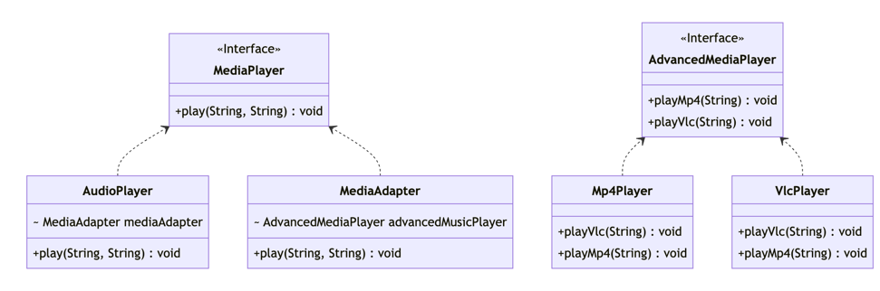

# 适配器模式
## 介绍

适配器模式（Adapter Pattern）是一种结构型设计模式，它允许将现有的类或接口转化为客户端所期望的另一种类或接口。适配器模式可以让原本不兼容的类能够合作无间，从而提高代码的复用性和可扩展性。



## 优点

- 可以让任何两个没有关联的类一起运行。
- 提高了类的复用：在将一些现有的功能放到新的环境中往往会出现该不能不能在新环境中直接使用的情况，适配器模式就像USB扩展口一样，可以通过扩展口链接原本接口不适配的插头。
- 灵活性好：通过适配器可以将使用方的需求通过逻辑匹配到对应的处理器上，并且迭代中也可扩展其灵活性。

## 缺点

- 过多的使用适配器会让代码变得凌乱，不易理解，无法直观上看出最终使用的基本类方法。
- 
## 应用场景

- 在系统中，需要使用一些已有的类，但这些类和目标接口不兼容的情况下，可以使用适配器。
- 在使用第三方库或组件时，需要将其接口转化为目标接口的情况下。

## 实现

适配器模式的实现通常包括以下几个部分：

- 目标接口（Target）：客户端所期望的接口，定义了客户端需要的方法。
- 适配器类（Adapter）：实现了目标接口，同时包含了一个被适配对象的引用。
- 被适配对象（Adaptee）：原本不兼容的类或接口，包含了客户端需要的方法。

定义一个目标接口，一个媒体播放器

```java:no-line-numbers
    public interface MediaPlayer {
        public void play(String audioType, String fileName);
    }
```

现存两种媒体播放器，都属于专业领域的媒体播放器，但他们对现有的需求不兼容，客户端期望的是获取一个能播放多种媒体的播放器

``` java:no-line-numbers
    public interface AdvancedMediaPlayer {
        public void playVlc(String fileName);
        public void playMp4(String fileName);
    }
```

<CodeGroup>

<CodeGroupItem title="mp4播放器">

```java:no-line-numbers
    public class Mp4Player implements AdvancedMediaPlayer {
        @Override
        public void playVlc(String fileName) {
            //什么也不做
        }
    
        @Override
        public void playMp4(String fileName) {
            System.out.println("播放"+fileName);
        }
    }

```
</CodeGroupItem>

<CodeGroupItem title="vlc播放器">

```java:no-line-numbers
    public class VlcPlayer implements AdvancedMediaPlayer {
        @Override
        public void playVlc(String fileName) {
            System.out.println("播放"+fileName);
        }
    
        @Override
        public void playMp4(String fileName) {
            //什么也不做
        }
    }

```

</CodeGroupItem>

</CodeGroup>

这时候我们就需要一个适配器去整合来两个媒体播放器的能力

```java:no-line-numbers
    public class MediaAdapter implements MediaPlayer {
        AdvancedMediaPlayer advancedMusicPlayer;
    
        public MediaAdapter(String audioType){
            if(audioType.equalsIgnoreCase("vlc") ){
                advancedMusicPlayer = new VlcPlayer();
            } else if (audioType.equalsIgnoreCase("mp4")){
                advancedMusicPlayer = new Mp4Player();
            }
        }
    
        @Override
        public void play(String audioType, String fileName) {
            if(audioType.equalsIgnoreCase("vlc")){
                advancedMusicPlayer.playVlc(fileName);
            }else if(audioType.equalsIgnoreCase("mp4")){
                advancedMusicPlayer.playMp4(fileName);
            }
        }
    }
```

现在我们对外提供一个能够播放多种媒体的播放器

```java:no-line-numbers
    public class AudioPlayer implements MediaPlayer {
        MediaAdapter mediaAdapter;
    
        @Override
        public void play(String audioType, String fileName) {
    
            //播放 mp3 音乐文件的内置支持
            if(audioType.equalsIgnoreCase("mp3")){
                System.out.println("播放mp3文件.: "+ fileName);
            }
            //mediaAdapter 提供了播放其他文件格式的支持
            else if(audioType.equalsIgnoreCase("vlc")
                    || audioType.equalsIgnoreCase("mp4")){
                mediaAdapter = new MediaAdapter(audioType);
                mediaAdapter.play(audioType, fileName);
            }
            else{
                System.out.println("找不到"+ audioType + "适配的播放器");
            }
        }
    }
```

客户端调用

```java:no-line-numbers
    public static void main(String[] args) {
        //这个案例适配器的作用就是在用户播放动作和播放器处理动作中间加一层,根据入参去判断要用那个播放器,业务曾并不关心用了那个,实现解耦
        AudioPlayer audioPlayer = new AudioPlayer();
        audioPlayer.play("mp3", "beyond the horizon.mp3");
        audioPlayer.play("mp4", "alone.mp4");
        audioPlayer.play("vlc", "far far away.vlc");
        audioPlayer.play("avi", "mind me.avi");
    }
```

## 最后

适配器模式可以帮助开发人员将现有的类或接口转化为客户端所期望的另一种类或接口，提高代码的复用性和可扩展性。在实际开发中，需要注意适配器不是在详细设计时添加的，而是为解决正在出现问题的项目的时候。
